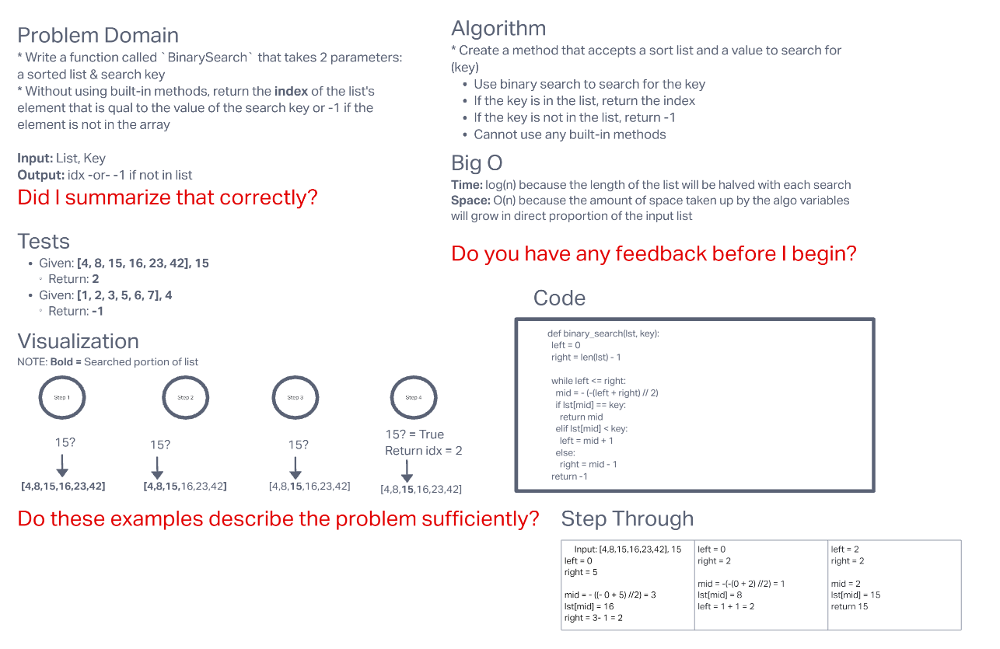

# Binary Search of Sorted Array

* Write a function called `BinarySearch` which takes in 2 parameters: a sorted array and the search key. Without utilizing any of the built-in methods in Python, return the index of the array’s element that is equal to the value of the search key, or -1 if the element is not in the array.
  * **NOTE:** The search algorithm used in your function should be a binary search.
    * Check the Resources section for details

## Whiteboard Process



## Approach & Efficiency

* The approach that I took was to create a function that used log time to search the provided list for the `key` value
* The first step was to find the mid point of the entire list by setting the left-most limit to `0` and the right-most search limit to the `length of the list -1`
  * `left = 0`
  * `right = len(lst) -1`
* This returns the middle of the whole lst
* Next, we need to enter into a loop that will search the list until we find the `key` value:
  * `while left <= right:` was used as the condition for the while loop
  * While the left-most value is smaller or equal to the right-most value, we know that we still have more sections of the list to search
    * If these numbers converge, we will either have found our `key` value or it will not be in the list and the function will then need to return `-1`
* Next, we need to actually calculate the middle index:
  * `mid = -(-(left + right) // 2)`
  * This will round up our mid point to the next integer
* We then need to set conditions that will modify our left and right search limits:
  * `if lst[mid] < key: left = mid + 1`
  * `if lst[mid] > key: right = mid - 1`
  * The logic here is that if the number at the midpoint of the search is less than the value of the `key`, then we will need to search the top half of the list from the index of the midpoint + 1 (new `left` value) until the end of the unsearched list, the index value assigned to `right`
    * If the number at the midpoint of the search is greater than the value of the `key`, then we will need to search the bottom half of the list from the start of the list until the new endpoint of the midpoint - 1, the index value assigned to `right`
* Once we find the `key` value, we need to return it
* If the `key` value is not in the list, we return `-1`
* Final product:

```py
def binary_search(lst, key):

  left = 0
  right = len(lst) - 1

  while left <= right:
    mid = - (-(left + right) // 2)
    if lst[mid] == key:
      return mid
    elif lst[mid] < key:
      left = mid + 1
    else:
      right = mid - 1
  return -1
```
