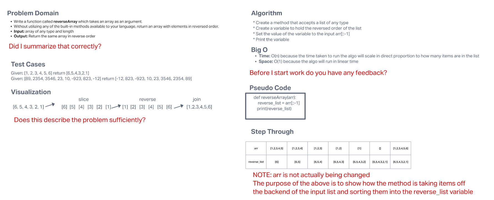

# Reverse an Array

* Write a function called `reverseArray` which takes an array as an argument.
* Without utilizing any of the built-in methods available to your language, return an array with elements in reversed order.

## Whiteboard Process

## Approach & Efficiency

* I approached this problem by examining how to best manipulate a list without using any built-in methods.
* Knowing that a slicing operation would work for the purposes of removing items from the input list, I then needed to determine how to add them to a new list and return the new list.
* I decided that using a new variable `reverse_list` would be a clean way of holding the new list and the name explicitly states what the list is.
* Big O Notation
  * O(N)
  * The algo grows linearly and in direct proportion to the size of the data input
