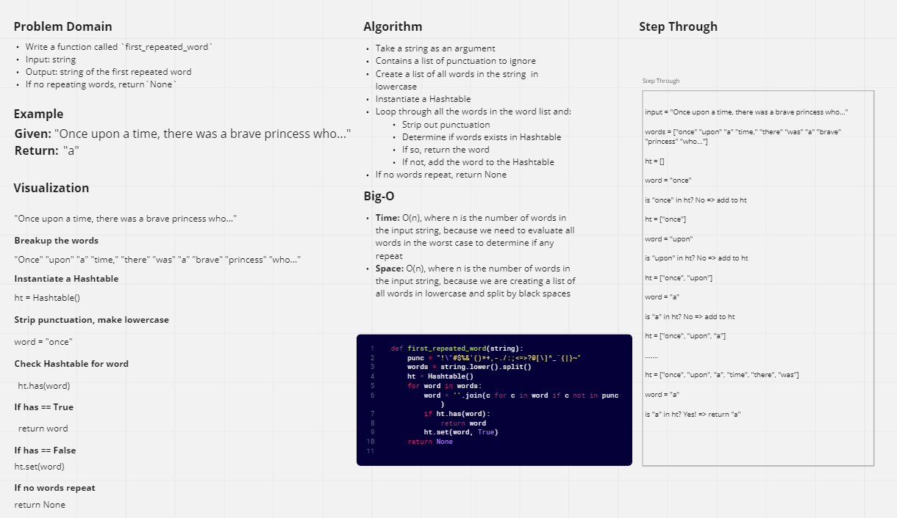

# Challenge Summary

Write a function called `repeated_word` that finds the first word to occur more than once in a string

* `repeated_word`
  * Arguments: string
  * Return: string

## Whiteboard Process



## Approach & Efficiency

* **Big-O**
  * **Time**: O(n), where `n` is the number of words in the input string. In the worst case, we may have to loop through the entire series of words to find two words that repeat themselves first.
  * **Space**: O(n), where `n` is the number of words in the input string. At the beginning of the script, we take the entire input and create a new list of all the words in the string.
* The `first_repeated_word` function works in the following manner:
  * It takes a string as an argument
  * It creates a new list of all the words in the string by turning all to lowercase and splitting the words out where separated by a space
  * We then create an instance of a `Hashtable` to hold our words
  * For every word in our `words` list, we strip out any punctuation included in the word after the split and create a new word that excludes the punctuation
  * We then check the `Hashtable` using the existing `has` method to see if the word is already in the `Hashtable`
  * If the word exists, we return the word as a string
  * If the word does not exist in the `Hashtable`, we add it to the table using the `set` method
  * If there are no repeating words, we return `None`

## Solution

```py
def first_repeated_word(string):
    punc = "!\"#$%&'()*+,-./:;<=>?@[\]^_`{|}~"
    words = string.lower().split()
    ht = Hashtable()
    for word in words:
        word = ''.join(c for c in word if c not in punc)
        if ht.has(word):
            return word
        ht.set(word, True)
    return None
```
