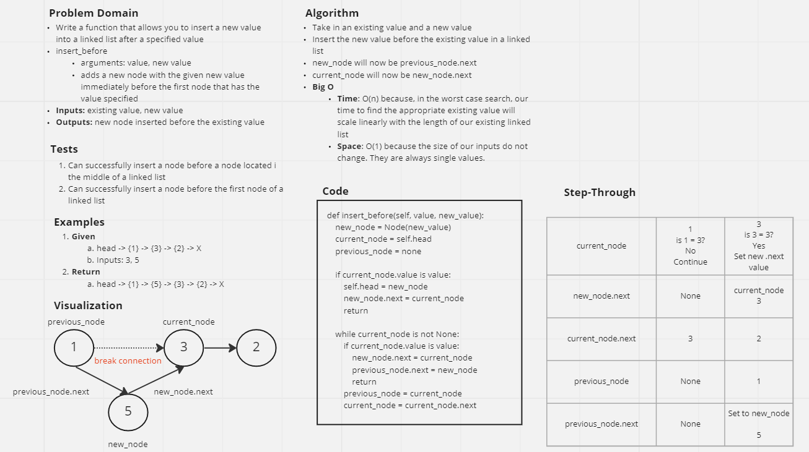

# Allow Insertions into Linked List

## Challenge

Write the following methods for the Linked List class:

* `append`
  * arguments: new value
  * adds a new node with the given value to the end of the list
* `insert_before`
  * arguments: value, new value
  * adds a new node with the given new value immediately before the first node that has the value specified
* `insert_after`
  * arguments: value, new value
  * adds a new node with the given new value immediately after the first node that has the value specified

## Whiteboard



## Approach & Efficiency

* `append`
  * Time: O(n)
  * Space: O(1)
* `insert_before`
  * Time: O(n)
  * Space: O(1)
* `insert_after`
  * Time: O(n)
  * Space: O(1)
* For each of the above functions, they will execute in linear time due the ever increasing time required to search ever-growing linked lists. As the length of the linked list grows, the time taken in the worst case to search the entire list will grow in direct proportion to the length of the list. However, each function will run in constant space since they iterate through one node at a time and the length of those nodes does not change.

## Tests

Tests conducted looked for the following:

1. Can successfully add a node to the end of the linked list
2. Can successfully add multiple nodes to the end of a linked list
3. Can successfully insert a node before a node located i the middle of a linked list
4. Can successfully insert a node before the first node of a linked list
5. Can successfully insert after a node in the middle of the linked list
6. Can successfully insert a node after the last node of the linked list

## Solution

```py
def append(self, value):
  """
  Takes a value as a parameter and appends it to the end of the list.
  """
  try:

    new_node = Node(value)
    current_node = self.head

    while current_node.next is not None:
      current_node = current_node.next
    current_node.next = new_node
  except TargetError:
    raise TargetError

def insert_before(self, value, new_value):
  """
  Takes a value and new_value as arguments and inserts the new_value immediately before the node containing the existing value.
  """
  try:
    new_node = Node(new_value)
    current_node = self.head
    previous_node = None
    if current_node is None:
      raise TargetError
    if current_node.value is value:
      self.head = new_node
      new_node.next = current_node
      return
    while current_node is not None:
      if current_node.value is value:
        new_node.next = current_node
        previous_node.next = new_node
        return
      previous_node = current_node
      current_node = current_node.next
    raise TargetError
  except TargetError:
    raise TargetError

def insert_after(self, value, new_value):
  """
  Takes a value and new_value as arguments and inserts the new_value immediately after the node containing the existing value.
  """
  try:
    new_node = Node(new_value)
    current_node = self.head
    while current_node is not None:
      if current_node.value is value:
        new_node.next = current_node.next
        current_node.next = new_node
        return
      current_node = current_node.next
    raise TargetError
  except TargetError:
    raise TargetError
```
