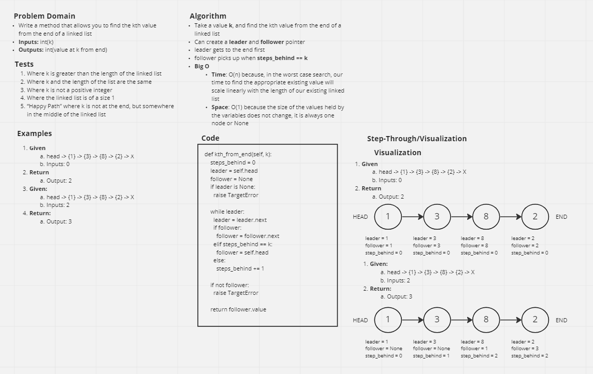
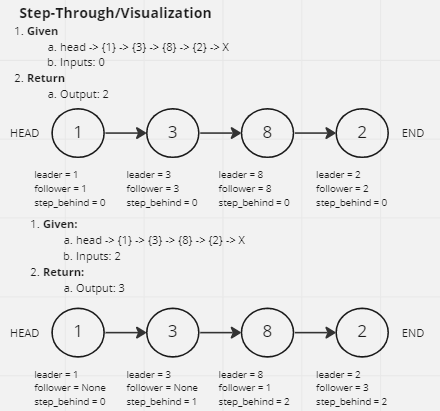

# Challenge Summary

Write the following method for the Linked List class:

`kth_from_end`

* Argument: a number, k, as a parameter.
* Return the node’s value that is k places from the tail of the linked list.
* You have access to the Node class and all the properties on the Linked List class as well as the methods created in previous challenges.

## Whiteboard Process



## Approach & Efficiency

* Take a value k, and find the kth value from the end of a linked list
* Create a `leader` and `follower` pointer offset when `steps_behind` is equal to `k`
  * `leader` cycles through list first
  * `follower` picks up when `steps_behind` == k
  * When `leader` reaches the tail of the linked list, `follower` will be `k` positions from the end
* Return the value of `follower`
  * `return follower.value`
* **Big O**
  * **Time:** `O(n)` because, in the worst case search, our time to find the appropriate existing value will scale linearly with the length of our existing linked list
  * **Space:** `O(1)` because the size of the values held by the variables does not change, it is always one node or None

## Solution

```py
steps_behind = 0
leader = self.head
follower = None

if leader is None:
  raise TargetError

while leader:
  leader = leader.next
  if follower:
    follower = follower.next
  elif steps_behind == k:
    follower = self.head
  else:
    steps_behind += 1

if not follower:
  raise TargetError

return follower.value
```

* **Example**


