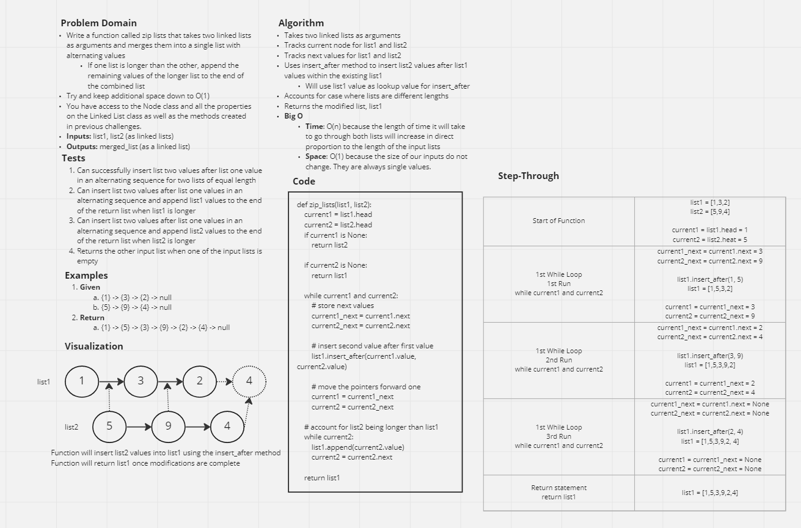

# Challenge Summary

* Write a function called `zip_lists`
* Arguments: 2 linked lists
* Returns: New Linked List, zipped as noted below
  * Zip the two linked lists together into one so that the nodes alternate between the two lists and return a reference to the the zipped list.
* Try and keep additional space down to O(1)
* You have access to the Node class and all the properties on the Linked List class as well as the methods created in previous challenges.

## Whiteboard Process



## Approach & Efficiency

* **Approach**
  * My approach was to first validate that both list contained values
    * If either list is empty, the function will return the other non-empty list
  * Once we validate that we have data, the next step is to instantiate a new `LinkedList` called `merged_list`
    * We will use existing methods on `LinkedList` to `insert` and `append` values to the `merged_list`
  * Because we have instantiated a new `LinkedList` we cannot `append` values to it given the current design of the `append` function
    * Therefore, we need a conditional that says, "if this is the first loop through the lists, we need to use the `insert` method to add the first value to `merged_list`
      * We accomplish this with a simple counter `loops` and set its initial condition to `0`
        * After the first loop, `loops` will iterate to `1` and the conditional will be skipped for future iterations through the linked lists
  * We now need to take into consideration three conditions we could encounter with our linked lists:
    1. `list1` and `list2` are the same length
    2. `list1` is longer than `list2`
    3. `list1` is shorter than `list2`
  * To account for these, we simply create two while loops that account for these conditions
    1. `while list1 and list2:`
    2. `while list2`
  * The function steps through each of these while loops in order
    * This means that once the condition of `list1 and list2` is not longer satisfied, that means that only one list has remaining values
    * If `list1` has remaining values, then no further action is required and the program can return the modified `list1` with the newly inserted values from `list2`
    * If `list2` still contains values, then the program will execute and additional while loop and `append` those values to `list1`
  * The programs ends when `list1` is returned
* **Efficiency**
  * **Time:** O(n) because as the length of our two input list grows, the time taken to complete the program will increase in direct proportion to the length of the lists
  * **Space:** O(1) because the size of the variables within the function will always be the same length


## Solution

```py
def zip_lists(list1, list2):
    """
    Takes two linked lists as arguments and returns a single list with the alternating values from the two lists in the order they appear in their original lists.

    Example:
    list1 = {1} -> {3} -> {2} -> null
    list2 = {5} -> {9} -> {4} -> null

    Expected Output: {1} -> {5} -> {3} -> {9} -> {2} -> {4} -> null
    """

    current1 = list1.head
    current2 = list2.head

    if current1 is None:
        return list2

    if current2 is None:
        return list1

    while current1 and current2:
        # store next values
        current1_next = current1.next
        current2_next = current2.next

        # insert second value after first value
        list1.insert_after(current1.value, current2.value)

        # move the pointers forward one
        current1 = current1_next
        current2 = current2_next

    # account for list2 being longer than list1
    while current2:
        list1.append(current2.value)
        current2 = current2.next
    
    return list1
```
