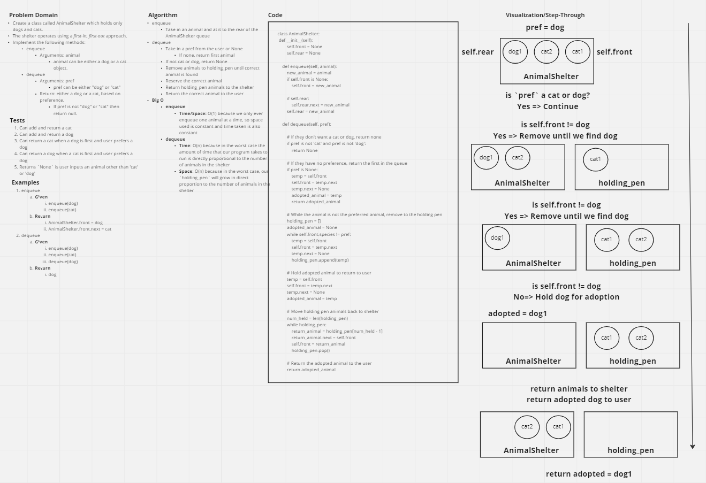

# Challenge Summary

* Create a class called `AnimalShelter` which holds only dogs and cats.
  * The shelter operates using a first-in, first-out approach.
* Implement the following methods:
  * `enqueue`
      * Arguments: animal
      * animal can be either a dog or a cat object.
  * `dequeue`
    * Arguments: pref
      * pref can be either "dog" or "cat"
    * Return: either a dog or a cat, based on preference.
      * If pref is not "dog" or "cat" then return null.

## Whiteboard Process



## Approach & Efficiency

* To avoid confusion, I took the approach of creating an entirely new class for `AnimalShelter` that has custom methods for enqueuing and dequeuing animals from the shelter instead of using existing `Queue` class
* `enqueue`
  * Method is the same as for the `Queue` class, however, the naming conventions are changed to reflect the fact that we are now adding animals to a shelter, not nodes to a stack or queue
  * Big O
    * Time/Space: O(1) because we only ever enqueue one animal at a time, so space used is constant and time taken is also constant
* `dequeue`
  * This method is a bit different since it takes a preference from the user (`pref`) for a `cat` or `dog`, or `None`
  * This means that we cannot always just return the first animal in the queue, so we need to move any non-preferred animals to a `holding_pen` then return them to the shelter after the preferred animal is `adopted`
  * We first check for the user preference:
    * If `pref` is not a `cat` or a `dog`, then we return `None`, since we only have cats and dogs
  * If they do not have a preference, we return the first animal in the shelter

    ```python
    if pref is None:
        temp = self.front
        self.front = temp.next
        temp.next = None
        adopted_animal = temp
        return adopted_animal
    ```

  * If the user preference is not fist in the shelter, we must remove any unwanted animals to the `holding_pen`

      ```python
      holding_pen = []
      adopted_animal = None
      while self.front.species != pref:
          temp = self.front
          self.front = temp.next
          temp.next = None
          holding_pen.append(temp)
      ```
  * We can now set aside the preferred animal to be `adopted`

    ```python
    # Hold adopted animal to return to user
    temp = self.front
    self.front = temp.next
    temp.next = None
    adopted_animal = temp
    ```

  * Once out `adopted` animal is set aside, we can now return the animals in the `holding_pen` back to the shelter by removing them in reverse order

  ```python
  # Move holding pen animals back to shelter
  num_held = len(holding_pen)
  while holding_pen:
      return_animal = holding_pen[num_held - 1]
      return_animal.next = self.front
      self.front = return_animal
      holding_pen.pop()
  ```

  * With everyone returned to the shelter, we can now give the `adopted` animal to the user

  ```python
  # Return the adopted animal to the user
  return adopted_animal
  ```

  * Big O
    * Time: O(n) because in the worst case the amount of time that our program takes to run is directly proportional to the number of animals in the shelter
    * Space: O(n) because in the worst case, our `holding_pen` will grow in direct proportion to the number of animals in the shelter

## Solution

```python
class AnimalShelter:
    def __init__(self):
        self.front = None
        self.rear = None

    def enqueue(self, animal):
        new_animal = animal
        if self.front is None:
            self.front = new_animal

        if self.rear:
            self.rear.next = new_animal
        self.rear = new_animal

    def dequeue(self, pref):

        # If they don't want a cat or dog, return none
        if pref is not 'cat' and pref is not 'dog':
            return None

        # If they have no preference, return the first in the queue
        if pref is None:
            temp = self.front
            self.front = temp.next
            temp.next = None
            adopted_animal = temp
            return adopted_animal

        # While the animal is not the preferred animal, remove to the holding pen
        holding_pen = []
        adopted_animal = None
        while self.front.species != pref:
            temp = self.front
            self.front = temp.next
            temp.next = None
            holding_pen.append(temp)

        # Hold adopted animal to return to user
        temp = self.front
        self.front = temp.next
        temp.next = None
        adopted_animal = temp

        # Move holding pen animals back to shelter
        num_held = len(holding_pen)
        while holding_pen:
            return_animal = holding_pen[num_held - 1]
            return_animal.next = self.front
            self.front = return_animal
            holding_pen.pop()

        # Return the adopted animal to the user
        return adopted_animal

class Dog:
    def __init__(self, species="dog", next=None):
        self.species = species
        self.next = next

    def __str__(self):
        return self.species

class Cat:
    def __init__(self, species="cat", next=None):
        self.species = species
        self.next = next

    def __str__(self):
        return self.species

if __name__ == '__main__':
    shelter = AnimalShelter()
    cat = Cat()
    print(f"cat instance: {cat}")
    print(type(cat))
    print(cat.__repr__())
    print(f"dir: {dir(cat)}")
    shelter.enqueue(cat)
    print(f"front: {shelter.front}")
    print(f"species: {shelter.front.species}")
    shelter.dequeue('cat')
```
