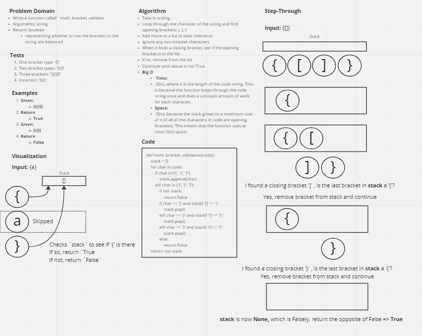

# Challenge Summary

* Write a function called `multi_bracket_validation`
* Arguments: string
* Return: boolean representing whether or not the brackets in the string are balanced

## Whiteboard Process



## Approach & Efficiency

* This program uses a stack to keep track of the opening brackets that have not yet been closed.
* Whenever it encounters an opening bracket, it pushes it onto the stack.
* When it encounters a closing bracket, it checks if the top of the stack contains the corresponding opening bracket.
* If it does, it `pops` the opening bracket from the stack.
* If it doesn't, or if the stack is empty when a closing bracket is encountered, it returns `False` to indicate that the brackets are not correctly balanced.
* Otherwise, it returns `True` if the stack is empty at the end of the loop.
* Big O Notation
  * **Time:** O(n), where n is the length of the code string. This is because the function loops through the code string once and does a constant amount of work for each character.
  * **Space:** O(n), because the stack grows to a maximum size of n (if all of the characters in code are opening brackets). This means that the function uses at most O(n) space.

## Solution

```py
# Check that all brackets have corresponding closing bracket
def multi_bracket_validation(code):
    stack = []
    for char in code:
        if char in ('(', '{', '['):
            stack.append(char)
        elif char in (')', '}', ']'):
            if not stack:
                return False
            if char == ')' and stack[-1] == '(':
                stack.pop()
            elif char == '}' and stack[-1] == '{':
                stack.pop()
            elif char == ']' and stack[-1] == '[':
                stack.pop()
            else:
                return False
    return not stack

if __name__ == '__main__':
    code = "(var x = {y: [1, 2, 3]});"
    print(multi_bracket_validation(code))  # Output: True

    code = "(var x = {y: [1, 2, 3]});"
    print(multi_bracket_validation(code))  # Output: True

    code = "(var x = {y: [1, 2, 3]}"
    print(multi_bracket_validation(code))  # Output: False
```
