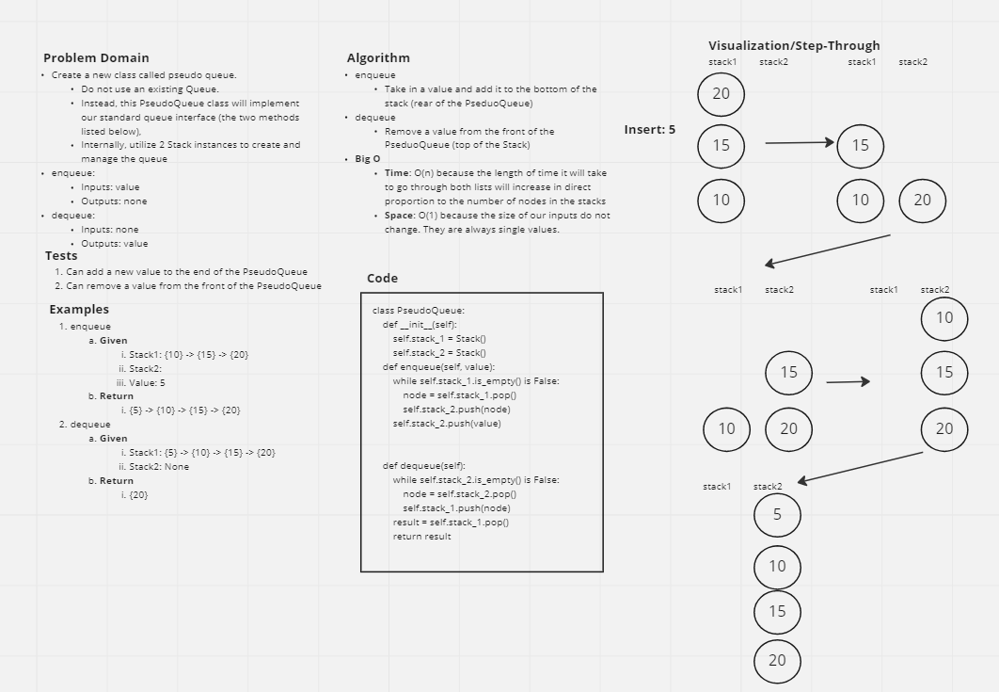

# Challenge Summary

* Create a new class called `PseudoQueue`.
  * Do not use an existing `Queue`.
  * Instead, this PseudoQueue class will implement our standard queue interface (the two methods listed below),
  * Internally, utilize 2 `Stack` instances to create and manage the queue


## Whiteboard Process



## Approach & Efficiency

* The approach that I took leverages the existence of the two stacks to allow the `enqueue` and `dequeue` methods to work together to move nodes around between the stacks.
* At the start, I create two instances of an empty `Stack`:

  ```py
  self.stack_1 = Stack()
  self.stack_2 = Stack()
  ```

* These `Stacks` now have the `push()` and `pop()` methods required to move nodes around in our `PseudoQueue`
* When `enqueue` is called, the method checks to see if `stack_1` is empty or not
  * If `stack_1` has values, it steps into the `while` loop and `pops` all nodes from `stack_1` to `stack_2`
  * If there are no values in `stack_1`, it immediately `pushes` the new node to to `stack_2`
* When `dequeue` is called, the method checks to see if `stack_2` has any nodes:
  * If `stack_2` does have values, then all values are `popped` from `stack_2` to `stack_1` and the top of `stack_1` is returned to the user
  * If `stack_2` `is_empty`, then the top value of `stack_1` is returned to the user
* Big O Notation
  * Time: O(n) because the amount of time that it will take to move nodes from `stack_1` to `stack_2` will increase in direct proportion to the number of nodes in the stack
  * Space: O(1) because the amount of space used by the method is independent of the size of the input; we do not create any new variables that change the size of their associated values


## Solution

```py
class PseudoQueue:
    def __init__(self):
        self.stack_1 = Stack()
        self.stack_2 = Stack()

    def enqueue(self, value):
        while self.stack_1.is_empty() is False:
            node = self.stack_1.pop()
            self.stack_2.push(node)
        self.stack_2.push(value)


    def dequeue(self):
        while self.stack_2.is_empty() is False:
            node = self.stack_2.pop()
            self.stack_1.push(node)
        result = self.stack_1.pop()
        return result
```
