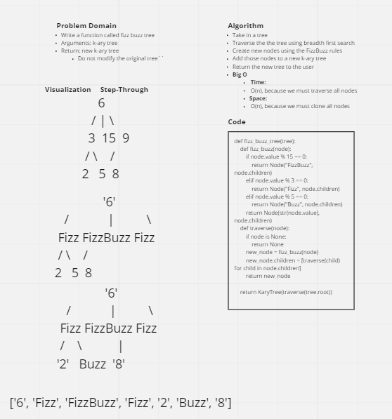

# Breadth First Search

## Challenge Summary

* Write a function called fizz buzz tree
  * Arguments: k-ary tree
  * Return: new k-ary tree

## Whiteboard Process



## Approach & Efficiency

* The `fizz_buzz_tree` works in the following manner:
  * It defines a helper function called fizz_buzz(node) that takes a node as an input, and checks whether its value is divisible by 15, 3, or 5 using the modulo operator (%).
  * If the value of the node is divisible by 15, it returns a new Node object with the value "FizzBuzz" and the same children as the original node.
  * If the value of the node is divisible by 3 but not divisible by 15, it returns a new Node object with the value "Fizz" and the same children as the original node.
  * If the value of the node is divisible by 5 but not divisible by 15 or 3, it returns a new Node object with the value "Buzz" and the same children as the original node.
  * If the value of the node is not divisible by 3, 5 or 15, the function returns a new Node object with the same value and the same children as the original node.
  * Then the traverse function, it takes the root of the tree as an input, if the node is None it returns None.
  * It gets the new node using fizz_buzz(node) function.
  * It iterates over all children node of the current node and applies the traverse(child) recursively on them, this way it creates new nodes for each children of the current node, and assigns it to the children property of the new_node.
  * Finally, it returns the new_node.
  * In the main function, the root of the new tree is the returned value of the traverse function applied on the original root of the tree, and it wraps it in an object of KAryTree class and return it.

This way, the function returns a new tree object that is a copy of the original tree, but with some of its node's values modified, without modifying the original tree.

* Big-O Notation
  * **Time:** O(n), where `n` is the number of nodes in the `tree`, because we must visit each node in the `tree` and get their values.
  * **Space:** O(n), where `n` is the number of nodes in the `tree`, because the number of new nodes created is equal to the input number of nodes.

## API

* Application contains the following function to be used with the `BinaryTree`class:
  * `fizz_buzz_tree`
    * Inputs: `k-ary tree`
    * Returns: `k-ary tree`
      * If the value is divisible by 3, replace the value with “Fizz”
      * If the value is divisible by 5, replace the value with “Buzz”
      * If the value is divisible by 3 and 5, replace the value with “FizzBuzz”
      * If the value is not divisible by 3 or 5, simply turn the number into a String.

### Solution

```py
def fizz_buzz_tree(tree):
    def fizz_buzz(node):
        if node.value % 15 == 0:
            return Node("FizzBuzz", node.children)
        elif node.value % 3 == 0:
            return Node("Fizz", node.children)
        elif node.value % 5 == 0:
            return Node("Buzz", node.children)
        return Node(str(node.value), node.children)

    def traverse(node):
        if node is None:
            return None
        new_node = fizz_buzz(node)
        new_node.children = [traverse(child) for child in node.children]
        return new_node

    return KaryTree(traverse(tree.root))
```

## Tests

* We tested the following circumstances with `pytest`:
  * The function returned a cloned k-ary tree with nodes divisible by 3 with values of 'Fizz', nodes divisible by 5 with values of 'Buzz', and nodes divisible by 3 & 5 returned with values of 'FizzBuzz'.
  * The function did not modify the original tree
    * We tested this by doing a breadth-first search on the original tree and ensure that the original numerical values were unmodified
