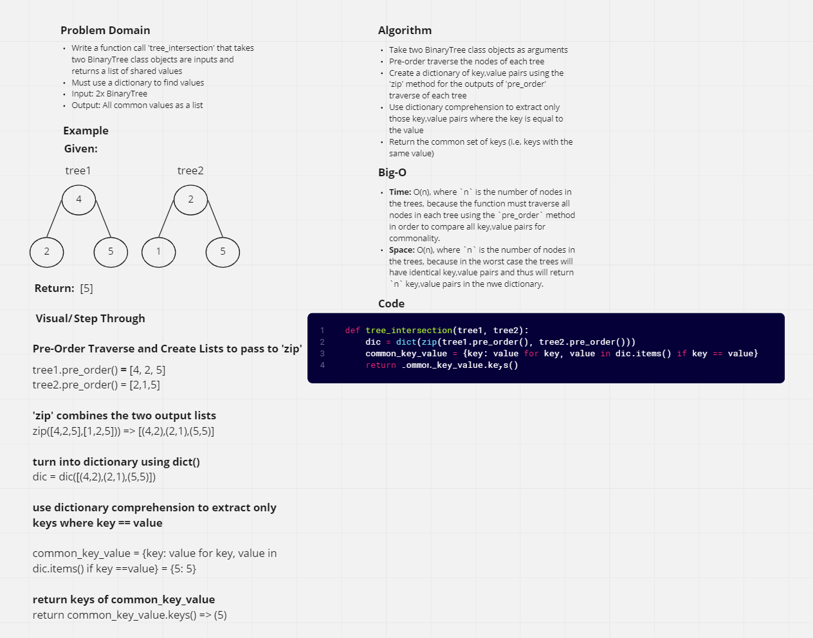

# Challenge Summary

* Write a function called `tree_intersection` that takes two binary trees as parameters.
* Using a dictionary, return a set of values found in both trees


## Whiteboard Process



## Approach & Efficiency

### Approach

* The function `tree_intersection` takes two `BinaryTree` class trees with existing `pre_order` methods as input and returns a set of common keys (keys with equal values) between the two trees.
* The function creates a dictionary series of `{key: value}` pairs using the method `zip`, which combines the outputs of the `pre_order` methods of both trees.
* Then, it uses a dictionary comprehension to extract only those key-value pairs where the key is equal to the value.
* Finally, it returns the keys of the resulting dictionary as a set.

### Efficiency

* **Time**: O(n), where `n` is the number of nodes in the trees, because the function must traverse all nodes in each tree using the `pre_order` method in order to compare all key,value pairs for commonality.
* **Space**: O(n), where `n` is the number of nodes in the trees, because in the worst case the trees will have identical key,value pairs and thus will return `n` key,value pairs in the nwe dictionary.

## Solution

```py
def tree_intersection(tree1, tree2):
    dic = dict(zip(tree1.pre_order(), tree2.pre_order()))
    common_key_value = {key: value for key, value in dic.items() if key == value}
    return common_key_value.keys()
```
