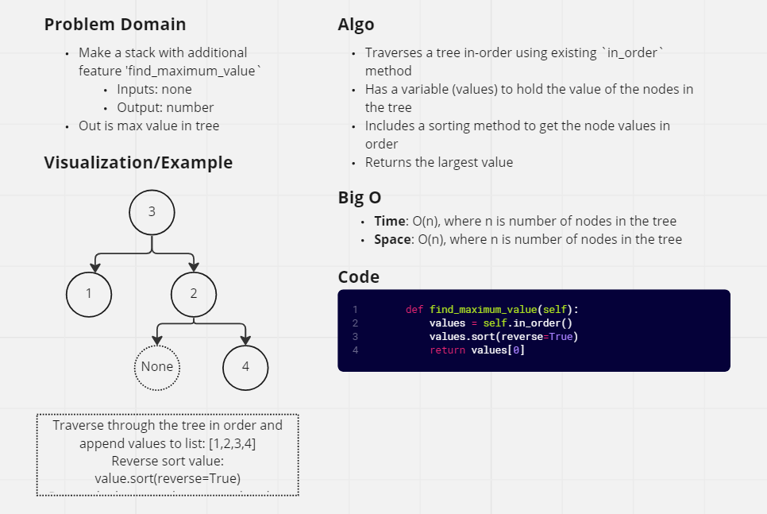

# Find Max Value in a Tree

## Challenge Summary

Find the Maximum Value in a Binary Tree

* Write the following method for the Binary Tree class:
  * find maximum value
    * Arguments: none
    * Returns: number
* Find the maximum value stored in the tree. You can assume that the values stored in the Binary Tree will be numeric.

## Whiteboard Process

## Approach & Efficiency

* The `find_maximum_value` method utilizes the existing `in_order` search method to go through all nodes in the tree.
* I chose to iterate through all nodes in order to ensure all nodes are captured for sorting to ensure that the max value is returned.
* Using the built-in `sort` method, we are able to sort the returned values in reverse order (`reverse=True`) and return the zeroth index of the list as our maximum value.
* Big O Notation
  * **Time**: O(n) because this method will always go through all nodes in order to find the maximum value.
  * **Space**: O(n) because the variable `values` will hold all values in the tree and sort them.

## API

* Application contains the following methods within the `LinkedList` class:
  * `find_maximum_value`
    * Inputs: none
    * Returns: number

## Tests

* We tested with `pytest` to ensure that the largest value in a tree was returned by the `find_maximum_value` method.
